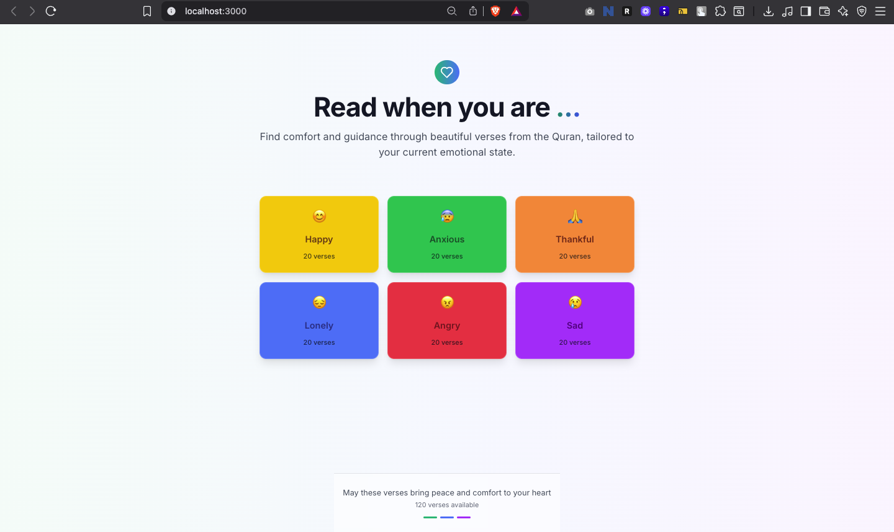
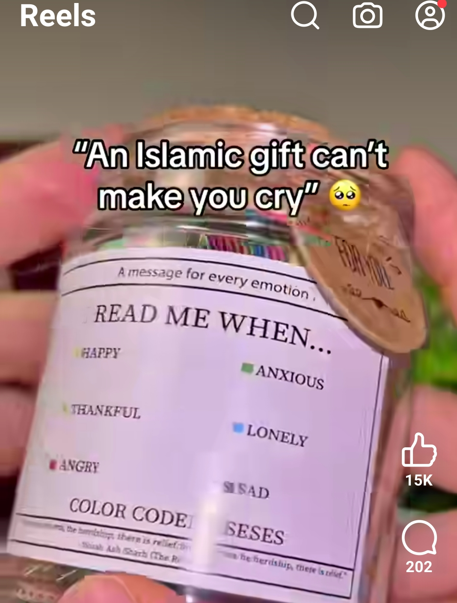

# 📿 **Read When You Are...**

_A beautiful web experience inspired by a real-life Quranic Jar._

---



## ✨ Inspiration



Saw This Facebook product ads: a physical jar filled with colorful paper slips. Each slip held a comforting verse from the Quran. The jar said:
**"Read when you are... lost, sad, lonely..."**
Each emotion was tied to a color—prompting you to pick a matching note.

That real-world moment sparked a thought:
**Why can't this be a calming, accessible web app for everyone?**

---

## 🌈 The Experience

This web app is a digital reimagination of that jar. Simple, soothing, and impactful.

- **Landing Section**:
  _"Read when you are..."_ → Followed by colored emotion buttons like **Sad**, **Lonely**, **Happy**, etc.

- **Color-Coded Emotion Buttons**:
  Each button visually reflects the mood (e.g., yellow for happy, blue for sad).

- **Modal on Click**:
  Clicking an emotion opens a modal with:

  - A beautiful gradient background that matches the emotion
  - A hand-picked Quranic verse relevant to that feeling
  - The verse reference included for context and authenticity

---

## 💻 Tech Stack

- **React + TypeScript**
- **Tailwind CSS** for rapid and clean styling
- **Lucide Icons** for consistent, elegant UI icons
- **Framer Motion** (optional) for smooth modal animation
- **Shadcn/ui** for accessible, beautifully styled UI components built on Radix UI

---

## 📦 Local Setup

```bash
# 1. Clone the repo
git clone https://github.com/yourusername/read-when-you-are.git

# 2. Install dependencies
yarn add

# 3. Run the app
yarn dev
```

---

## 🙏 Why This Matters

The Quran is timeless.
But our modern-day anxieties feel louder than ever.
This app bridges that gap—offering instant solace from the Quran, exactly when you need it.

Let this be your **digital Quran Jar.**

---

## 📌 Future Plans

- Add **more emotions** and **verses**
- Enable **search by mood or keyword**
- Allow users to **submit their own favorite ayat**
- Possibly add **audio recitations**

---

## 📸 Credit

The original idea came from a **Facebook post** (screenshot included above) that emotionally resonated.
